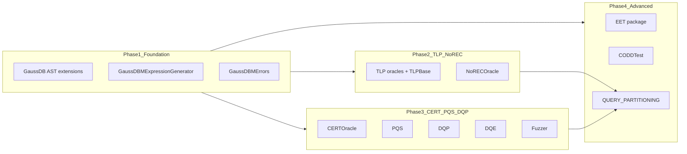

# SQLancer GaussDB-M 独立 Test Oracle 设计与实现计划

**日期**：2026-04-10  
**范围**：为 `gaussdb-m` 实现与 MySQL 对齐的独立 test oracle，支持下列选项：

`AGGREGATE`, `HAVING`, `GROUP_BY`, `DISTINCT`, `NOREC`, `TLP_WHERE`, `PQS`, `CERT`, `FUZZER`, `DQP`, `DQE`, `EET`, `CODDTEST`, `QUERY_PARTITIONING`。

---

## 1. 现状与参照

- 目标枚举与行为可直接对照 `sqlancer-main/sqlancer-main/src/sqlancer/mysql/MySQLOracleFactory.java`：各 oracle 的类名、组合关系（尤其 `QUERY_PARTITIONING`）、以及 `requiresAllTablesToContainRows()`（PQS、CERT、CODDTEST）。
- GaussDB-M 当前实现见 `sqlancer-main/sqlancer-main/src/sqlancer/gaussdbm/GaussDBMOracleFactory.java`：除 `TLP_WHERE` 外均为占位委托到同一实现。
- GaussDB-M 已有独立 AST（`GaussDB*`）、`GaussDBSelect` 已实现 `Select<GaussDBJoin, GaussDBExpression, GaussDBTable, GaussDBColumn>`，与通用 `NoRECOracle`、`CERTOracle` 的泛型约束兼容；缺的是生成器侧对 `NoRECGenerator` / `CERTGenerator` 的完整实现及配套 AST（聚合、函数等）。

---

## 2. 总体结构（分阶段）

---

## 3. Phase 1：AST、ToString、错误集与生成器基础

1. **聚合与可选表达式节点**（TLP Aggregate / NoREC / PQS / CODD 的共性依赖）
   - 新增 `GaussDBAggregate`（及与 MySQL 对齐的少量函数枚举，至少覆盖 TLP 用到的 COUNT/SUM/MIN/MAX）。
   - NoREC 的未优化查询在 MySQL 中使用 `IF(...)`（`MySQLExpressionGenerator.generateUnoptimizedQueryString`）：在 M-兼容语法下实现等价物（`IF` 或 `CASE WHEN`），并新增对应 AST 节点或在 visitor 中生成内联 SQL。
   - 扩展 `GaussDBToStringVisitor`：`visitSpecific` 与 `visit(GaussDBSelect)` 需支持 `DISTINCT`/`ALL`（类比 `MySQLSelect` 的 `SelectType`）、聚合、`ORDER BY`/`LIMIT` 若后续 oracle 需要。

2. **扩展 `GaussDBSelect`**
   - 增加 `SelectType`（DISTINCT/ALL）、以及 PQS/DQP 可能用到的 `limit`/`offset` 表达式字段（若 `SelectBase` 已有 limit/offset，则保证 visitor 输出 M-兼容语法）。

3. **`GaussDBMErrors`**
   - 对照 `MySQLErrors` 增加 `getExpressionHavingErrors`、以及可选的正则类错误。
   - 按 GaussDB-M 实际报错文案增量调整（冒烟阶段收集后收敛）。

4. **扩展 `GaussDBMExpressionGenerator`**
   - 实现 `NoRECGenerator` 与 `CERTGenerator`（接口见 `sqlancer.common.gen.NoRECGenerator`、`CERTGenerator`），逻辑从 `MySQLExpressionGenerator` 相应段落移植并删掉 GaussDB-M 不支持的修饰（如 MySQL 专用 hint/STRAIGHT_JOIN 等；`MySQLTLPBase` 中的 `MySQLHintGenerator` 在 GaussDB-M 可省略或空实现）。
   - 保留/对齐 `generateExpressions`、`setColumns`、`getRandomJoinClauses`（沿用 `GaussDBJoin` 与表列表更新逻辑）。

5. **GaussDB-M 专用 TLP 基类**
   - 新增 `GaussDBMTLPBase`，类比 `MySQLTLPBase`：继承 `TernaryLogicPartitioningOracleBase`，用 `GaussDBMGlobalState` / `GaussDBTables` / `GaussDBMExpressionGenerator` / `GaussDBToStringVisitor.asString` 组装 FROM/JOIN，不加 `ORDER BY`（避免 UNION 语法问题，与 MySQL 侧注释一致）。

---

## 4. Phase 2：TLP 族 + NOREC + TLP_WHERE

在包 `sqlancer.gaussdbm.oracle` 下新增类，分别对应 MySQL 同名 oracle（替换类型与 Visitor）：

| Oracle | 参照实现 |
|--------|----------|
| AGGREGATE | `MySQLTLPAggregateOracle` |
| HAVING | `MySQLTLPHavingOracle` |
| GROUP_BY | `MySQLTLPGroupByOracle` |
| DISTINCT | `MySQLTLPDistinctOracle` |
| TLP_WHERE | 已有 `TLPWhereOracle` + 生成器；改为使用 `ExpectedErrors` 与 MySQL 一致的表达式错误集合构建方式 |
| NOREC | `new NoRECOracle<>(globalState, gen, expectedErrors)` |

---

## 5. Phase 3：CERT、PQS、DQP、DQE、FUZZER

1. **CERT**  
   - `new CERTOracle<>(globalState, gen, expectedErrors, rowCountParser, queryPlanParser)`。  
   - **关键风险**：MySQL 使用固定列下标解析 `EXPLAIN` 结果。必须在真实 GaussDB-M 上执行 `EXPLAIN <select>`，根据实际 ResultSet 元数据实现解析器；若与 MySQL 不一致，单独封装 `GaussDBMCERTExplainParser`。

2. **PQS**  
   - 移植 `MySQLPivotedQuerySynthesisOracle` → `GaussDBMPivotedQuerySynthesisOracle`，继承 `PivotedQuerySynthesisBase`。  
   - 去掉或替换 MySQL 专有 `modifiers`（STRAIGHT_JOIN 等）。

3. **DQP / DQE**  
   - 分别移植 `MySQLDQPOracle`、`MySQLDQEOracle`。

4. **FUZZER**  
   - 移植 `MySQLFuzzer` 为 GaussDB-M 版本，仅保留当前 AST/生成器能打印的构造；其余分支删除或 `IgnoreMeException`。

以上类在 `GaussDBMOracleFactory` 中为独立 `create()`，不再互相委托（除 `QUERY_PARTITIONING` 外）。

---

## 6. Phase 4：EET、CODDTEST、QUERY_PARTITIONING

1. **QUERY_PARTITIONING**  
   - 与 MySQL 一致：组合 `TLP_WHERE`、`HAVING`、`GROUP_BY`、`AGGREGATE`、`DISTINCT`、`NOREC` 的 `CompositeTestOracle`，外层包装对 `AssertionError` 中含 `the counts mismatch` / `The size of the result sets mismatch` 的消息转为 `IgnoreMeException`。

2. **EET**（工作量最大）  
   - 参照 `sqlancer.mysql.oracle.eet` 整包平行移植到 `sqlancer.gaussdbm.oracle.eet`，将 `MySQL*` 引用替换为 `GaussDB*` / `GaussDBMExpressionGenerator`。  
   - **前置条件**：EET 依赖 UNION、WITH/CTE、派生表、文本片段节点等；若当前 GaussDBM AST 不足，需按 MySQL 侧最小依赖集增量补 AST + `GaussDBToStringVisitor`。可分迭代先交付仅 plain SELECT 的 EET 子集，再扩展 UNION/CTE。

3. **CODDTEST**  
   - 移植 `MySQLCODDTestOracle` 与 `CODDTestBase` 的使用方式；子查询、折叠表达式等涉及的类型若 GaussDBM 尚无对应节点，需同步补 AST 或缩小生成范围（与 EET 可复用部分子查询 AST）。

---

## 7. Phase 5：工厂、测试与文档

1. **更新 `GaussDBMOracleFactory`**  
   - 枚举与用户列表一致；每个常量独立 `create()`；为 PQS、CERT、CODDTEST 覆写 `requiresAllTablesToContainRows()`（与 MySQL 一致）。  
   - 核对 `SQLProviderAdapter` 是否在跑 oracle 前根据该方法补行。

2. **测试**  
   - 扩展 `GaussDBMOracleIsolationTest`：断言枚举包含上述 14 项且均为真实工厂（避免回归为全委托）。  
   - 更新 `docs/gaussdb-smoke.md` 与 `run-gaussdb-oracles-smoke.ps1`（若存在），覆盖新 oracle 名称。

3. **Release notes**  
   - 按项目规则更新 `release_notes.md`（版本末位 +1，日期与发布日一致）。

---

## 8. 风险与顺序建议

- **CERT**：完全依赖 EXPLAIN 列布局；应尽早用真实实例验证。  
- **EET / CODDTEST**：依赖 AST 广度最大；可在 Phase 2–3 完成后并行推进。  
- **与 MySQL 行为差异**：浮点比较、COUNT/SUM 空集、`UNION` vs `UNION ALL` 等启发式应在 GaussDB-M 侧从 MySQL 实现原样复用，再根据 GaussDB-M 实测微调。

---

## 9. 实施任务清单（Todos）

| ID | 内容 |
|----|------|
| phase1-ast-gen-errors | 扩展 GaussDB AST（聚合、DISTINCT、IF/CASE）、GaussDBToStringVisitor、GaussDBMErrors；GaussDBMExpressionGenerator 实现 NoRECGenerator + CERTGenerator + GaussDBMTLPBase |
| phase2-tlp-norec | 实现 GaussDBM TLP oracle 五件套 + TLP_WHERE/NOREC 接线 |
| phase3-cert-pqs-dqp | 实现 CERT（含 EXPLAIN 解析）、PQS、DQP、DQE、Fuzzer 的 GaussDB-M 版本 |
| phase4-eet-codd-qp | 移植 eet 包与 CODDTEST；实现 QUERY_PARTITIONING Composite + 误判过滤 |
| phase5-factory-tests-release | 更新 GaussDBMOracleFactory、单测、冒烟文档与 release_notes.md |

---

## 10. 主要代码路径索引

- GaussDB-M 包：`sqlancer-main/sqlancer-main/src/sqlancer/gaussdbm/`
- MySQL 参照：`sqlancer-main/sqlancer-main/src/sqlancer/mysql/`（含 `oracle/`、`oracle/eet/`、`gen/`）
- 通用 oracle：`sqlancer-main/sqlancer-main/src/sqlancer/common/oracle/`
- 通用生成器接口：`sqlancer-main/sqlancer-main/src/sqlancer/common/gen/`
