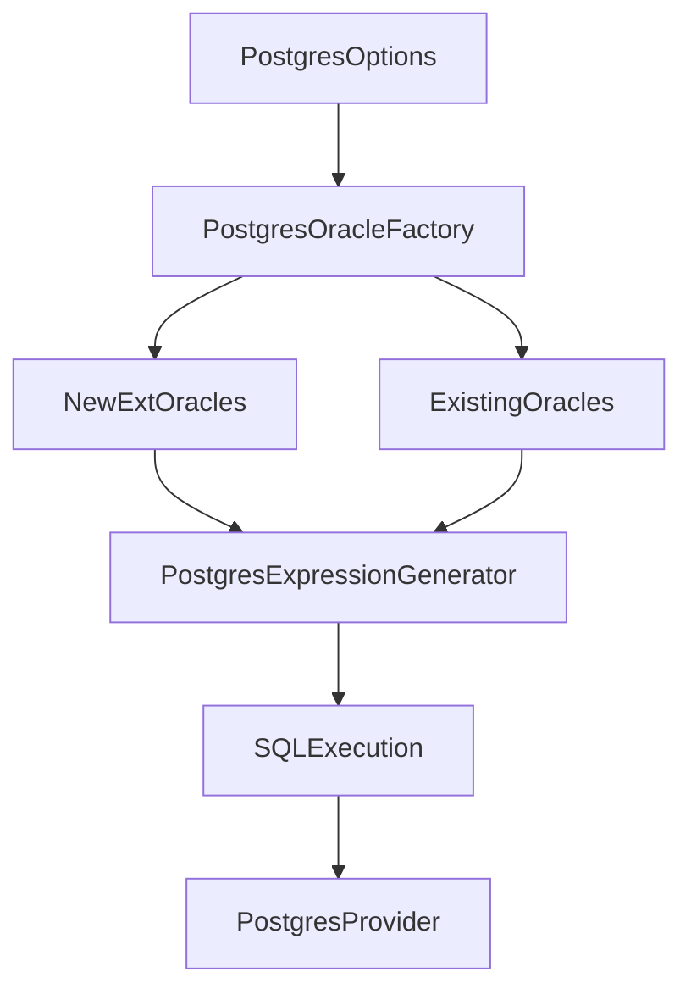

# SQLancer PostgreSQL Oracle Support & Extension Design (2026-04-10)

## 1. 背景与目标

当前项目的 PostgreSQL（`postgres` 子命令）已支持多种 test oracle；本文档用于确认与你的目标清单对齐情况，并给出隔离架构与后续开发/验收建议。

**目标（需支持的全部 oracle）**：
`AGGREGATE`、`HAVING`、`GROUP_BY`、`DISTINCT`、`NOREC`、`TLP_WHERE`、`PQS`、`CERT`、`FUZZER`、`DQP`、`DQE`、`EET`、`CODDTEST`、`QUERY_PARTITIONING`

**关键约束**：
- **隔离**：新增 oracle 需与现有 oracle 实现隔离，互相独立
- **不影响其他 DBMS**：不改变 MySQL/GaussDBM/SQLite3/TiDB 等数据库的 oracle 行为
- **接入方式**：扩展现有 `PostgresOracleFactory`（入口补齐），新增实现放入独立包

> 说明：扩展枚举入口与“实现隔离”并不冲突。隔离重点放在新增实现类、expected errors、开关与默认行为不变上。

---

## 2. 当前 PostgreSQL 已支持 oracle 盘点（代码实证）

### 2.1 入口文件
- **Provider**：`sqlancer-main/sqlancer-main/src/sqlancer/postgres/PostgresProvider.java`
- **Options**：`sqlancer-main/sqlancer-main/src/sqlancer/postgres/PostgresOptions.java`
  - `--oracle` 参数：`List<PostgresOracleFactory>`
  - 默认：`QUERY_PARTITIONING`
- **OracleFactory**：`sqlancer-main/sqlancer-main/src/sqlancer/postgres/PostgresOracleFactory.java`

### 2.2 已接入（可通过 CLI 选择）
当前 `PostgresOracleFactory` 已提供（均可通过 `--oracle` 选择）：
- `NOREC`
- `PQS`
- `WHERE`（历史名称，等价于 `TLP_WHERE`，复用通用 `TLPWhereOracle`）
- `TLP_WHERE`（`WHERE` 的别名入口）
- `HAVING`
- `AGGREGATE`
- `DISTINCT`
- `GROUP_BY`
- `QUERY_PARTITIONING`（组合：`TLP_WHERE` + `HAVING` + `AGGREGATE`）
- `CERT`
- `FUZZER`
- `DQP`
- `DQE`
- `EET`
- `CODDTEST`

### 2.3 目标清单对齐结论
- 目标清单中的 14 个 oracle **均已在 `PostgresOracleFactory` 中暴露为枚举项**（含 `TLP_WHERE` 作为 `WHERE` 的别名入口）。
- `QUERY_PARTITIONING` 仍为默认 oracle（见 `PostgresOptions.java`）。

### 2.4 关键实现位置（用于开发/排障快速定位）
- **TLP 族**：
  - `WHERE`/`TLP_WHERE`：通用 `TLPWhereOracle`（入口在 `PostgresOracleFactory`）
  - `HAVING`：`sqlancer.postgres.oracle.tlp.PostgresTLPHavingOracle`
  - `AGGREGATE`：`sqlancer.postgres.oracle.tlp.PostgresTLPAggregateOracle`
  - `DISTINCT`：`sqlancer.postgres.oracle.ext.PostgresTLPDistinctOracle`
  - `GROUP_BY`：`sqlancer.postgres.oracle.ext.PostgresTLPGroupByOracle`
- **差分/等价类**：
  - `DQP`：`sqlancer.postgres.oracle.ext.PostgresDQPOracle`
  - `DQE`：`sqlancer.postgres.oracle.ext.PostgresDQEOracle`
  - `CODDTEST`：`sqlancer.postgres.oracle.ext.PostgresCODDTestOracle`
- **EET**：
  - 入口：`sqlancer.postgres.oracle.ext.eet.PostgresEETOracle`
  - 关键组件：`sqlancer.postgres.oracle.ext.eet.*`（`QueryGenerator`/`QueryTransformer`/`Reproducer`/`QueryExecutor` 等）

---

## 3. 新增 Oracle 的总体架构设计（隔离思路）

### 3.1 设计原则
- **入口补齐**：在 `PostgresOracleFactory` 中补齐目标枚举项/别名项
- **实现隔离**：新增实现类放入独立包，避免与现有 `sqlancer.postgres.oracle.*` 混杂
- **向后兼容**：
  - 保留旧 `WHERE`（不破坏历史 CLI 用法）
  - 新增 `TLP_WHERE` 作为 `WHERE` 的别名入口
  - `QUERY_PARTITIONING` 默认行为不变
- **不影响其他 DBMS**：不修改 `sqlancer.common` 的既有默认逻辑；若需要扩展，采用纯新增且向后兼容的方式

### 3.2 模块/包拆分建议
保留现有实现包：
- `sqlancer.postgres.oracle.*`（PQS、FUZZER 等）
- `sqlancer.postgres.oracle.tlp.*`（TLP base/having/aggregate）

新增独立包（现状已落地）：
- `sqlancer.postgres.oracle.ext`
  - `PostgresTLPDistinctOracle` / `PostgresTLPGroupByOracle`
  - `PostgresDQPOracle` / `PostgresDQEOracle`
  - `PostgresCODDTestOracle`
- `sqlancer.postgres.oracle.ext.eet`
  - `PostgresEETOracle` 及其 `QueryGenerator`/`QueryTransformer`/`QueryExecutor`/`Reproducer` 等组件

### 3.3 数据流（高层）
保持 `postgres` 子命令流程不变，只在选择 oracle 时新增可选项：

---

## 4. Oracle 逐项落地策略（映射与实现要点）

### 4.1 已有且保持不变
- `NOREC`：保持现状（通用 `NoRECOracle`）
- `PQS`：保持 `PostgresPivotedQuerySynthesisOracle`
- `CERT`：保持通用 `CERTOracle` + Postgres parser
- `FUZZER`：保持 `PostgresFuzzer`
- `HAVING`：保持 `PostgresTLPHavingOracle`

### 4.2 入口/命名对齐（现状）
- `TLP_WHERE`
  - 枚举项：`TLP_WHERE`
  - 实现：内部直接调用 `WHERE.create(globalState)`，并保留旧 `WHERE`
- `AGGREGATE`
  - 枚举项：`AGGREGATE`
  - 实现：直接实例化 `PostgresTLPAggregateOracle`

### 4.3 新增 TLP 变体：`DISTINCT` / `GROUP_BY`
- `DISTINCT`
  - 新增 `PostgresTLPDistinctOracle`（放 `sqlancer.postgres.oracle.ext`）
  - 重点：Postgres 对 `SELECT DISTINCT` + `ORDER BY` 有严格约束，需要对生成器/expected errors 做降级处理
- `GROUP_BY`
  - 新增 `PostgresTLPGroupByOracle`
  - 重点：先限制高风险语法（窗口函数、复杂 grouping sets 等）以降低误报

### 4.4 新增：`DQP` / `DQE` / `EET` / `CODDTEST`
这些 oracle 在 Postgres 侧缺失，但项目里已有通用基类与其他 DBMS 的实现可参考：

- `DQE`
  - 通用基类：`sqlancer/common/oracle/DQEBase.java`
  - 参考：MySQL、GaussDBM 的 DQE 实现
  - Postgres 策略：最小可运行版本 + 保守禁用高风险语法 + 独立 expected errors

- `DQP`
  - 参考：MySQL、GaussDBM、TiDB 的 DQP 实现
  - Postgres 策略：优先对接 `EXPLAIN`/plan 提取能力，解析失败则跳过样本不误报

- `EET`
  - 参考：MySQL/GaussDBM 的 EET 实现
  - Postgres 策略：先限定在简单表达式子集，逐步扩面

- `CODDTEST`
  - 通用基类：`sqlancer/common/oracle/CODDTestBase.java`
  - 参考：MySQL/SQLite3/GaussDBM 的 CODDTEST 实现
  - Postgres 策略：类型白名单 + 保守约束，避免类型系统导致的不可判定情形

---

## 5. 隔离与回归安全策略

### 5.1 隔离边界
- 只在 Postgres 范围改动：
  - 修改 `sqlancer/postgres/PostgresOracleFactory.java`（补齐枚举入口）
  - 新增文件全部放在 `sqlancer/postgres/oracle/ext/**`
- 不修改其他 DBMS 的 provider/options/oracle factory
- 不修改 `sqlancer.common` 的既有默认行为（如需能力优先在 Postgres ext 内封装）

### 5.2 行为兼容策略
- 保留旧 `WHERE` 枚举项，不改变其语义
- 新增 `TLP_WHERE` 仅作为别名入口
- `QUERY_PARTITIONING` 仍作为默认 oracle

---

## 6. 开发计划（分阶段）

### 阶段 0：现状对齐（已完成）
- 目标清单中的 oracle 均已在 `PostgresOracleFactory` 暴露（含 `TLP_WHERE`/`AGGREGATE`/`DISTINCT`/`GROUP_BY`/`DQP`/`DQE`/`EET`/`CODDTEST`）。
- `QUERY_PARTITIONING` 仍为默认 oracle，兼容旧 `WHERE` 名称。

### 阶段 1：可运行性与误报控制（建议作为下一步重点）
- **统一每个 oracle 的“跳过策略”**：对解析失败、计划提取失败、不可比较结果等场景，明确使用 `IgnoreMeException`/expected errors 兜底，避免误报。
- **expected errors 归档**：将 `ext` 系列 oracle 的 expected errors 维护为独立集合（不污染既有包），并在文档中列出来源/理由。
- **稳定性配置**：为高风险 oracle（`DQP`/`DQE`/`EET`/`CODDTEST`）补齐开关/约束项（表达式子集、类型白名单、变换上限等），并给出推荐默认值。

### 阶段 2：验收自动化（建议）
- 增加针对 `postgres --oracle=<X>` 的 **短时 smoke** 脚本/说明（便于 CI 或本地快速回归）。
- 对关键 oracle 增加最小单测（至少覆盖 factory 接入、oracle create 及一次 query 执行路径）。

---

## 7. 验收建议（单元测试 + 编译 + 不影响其他 DBMS）

- **单 oracle smoke**：每个 oracle 单独运行短时冒烟，确保不崩溃、无大量工具侧非法 SQL
- **单元测试**：每新增一个 oracle/入口，补齐对应单元测试覆盖核心路径
- **全量回归**：`mvn test`（或项目既定构建命令）全绿，确保其他 DBMS 的测试不受影响
- **发布记录**：实现完成后按项目规则更新 `release_notes.md`（版本末位递增，日期 2026-04-10）

